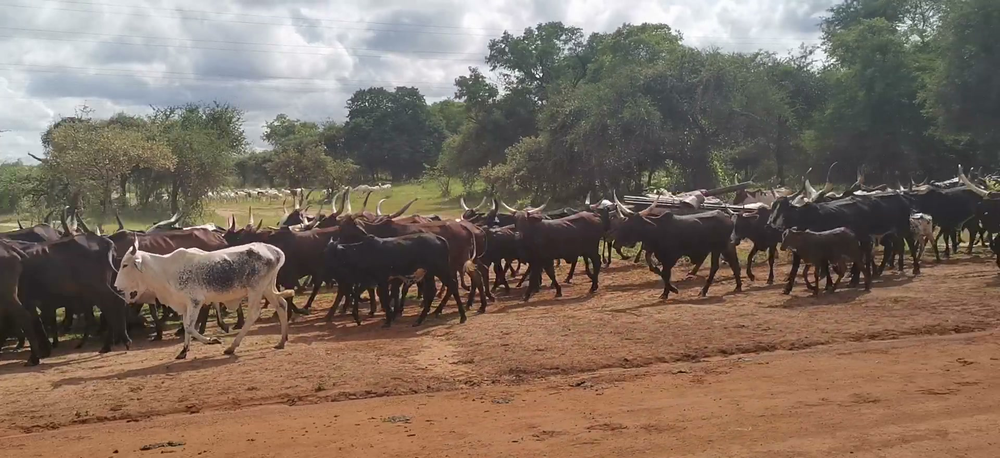
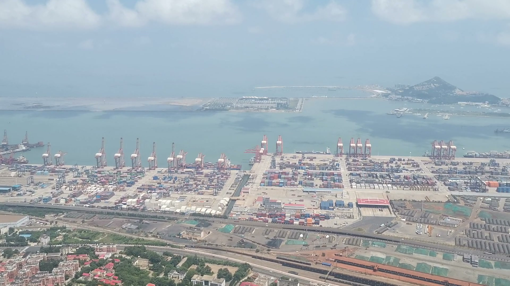
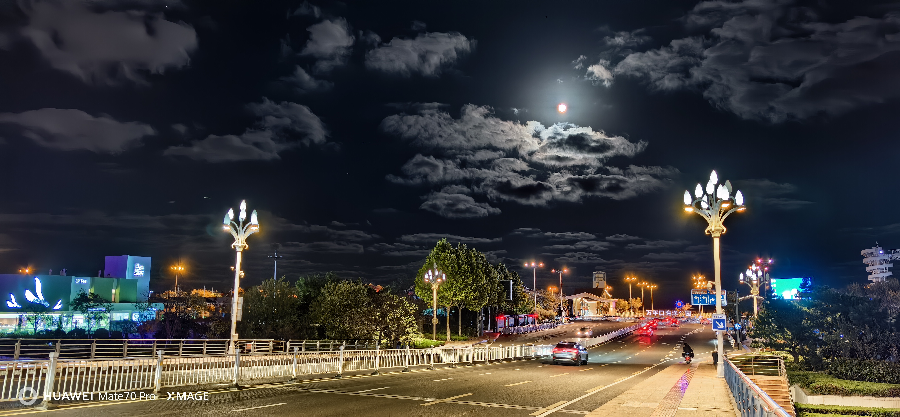
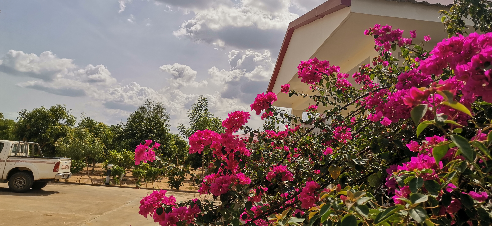

<!DOCTYPE html> <html lang="zh-CN"> <head>   <meta charset="UTF-8">   <meta name="viewport" content="width=device-width, initial-scale=1.0">   <title>Jianqiang &mdash; Personal Site v2</title>   <meta name="description" content="Articles, equipment, 3D models, travel photos, music, videos, and engineering proposals by Jianqiang">   <link rel="preconnect" href="https://fonts.googleapis.com">   <link rel="preconnect" href="https://fonts.gstatic.com" crossorigin>   <link href="https://fonts.googleapis.com/css2?family=Playfair+Display:ital,wght@0,400;0,600;0,700;1,400&family=Inter:wght@300;400;500;600&display=swap" rel="stylesheet">   <link rel="stylesheet" href="css/style.css"> </head> <body>  <header class="site-header">   
     <a href="#" class="logo">       J       Jianqiang\n      <button class="lang-toggle" id="langToggle" aria-label="Switch language">ZH / EN</button>     </a>     <button class="nav-toggle" aria-label="Toggle menu" aria-expanded="false">            </button>     <nav class="main-nav" id="mainNav">       <a href="#blog">Articles</a>       <a href="#equipment">Equipment</a>       <a href="#models">3D Models</a>       <a href="#creative">Creative</a>       <a href="#music">Music</a>       <a href="#videos">Video</a>       <a href="#gallery">Gallery</a>       <a href="#travel">Travel</a>       <a href="#engineering">Engineering</a><a href="#books">Books</a><a href="#science">Science</a><a href="#bookstore">Bookstore</a>       <a href="#books">Books</a>       <a href="#science">Science</a>       <a href="#bookstore">Bookstore</a>     </nav>   
 </header>  <section class="hero">   
     
Engineer &middot; Maker &middot; Writer
     <h1>Exploring technology, sharing ideas.</h1>     
Articles on AI and tech, engineering proposals, 3D models, music, photos &mdash; all in one place.
     <a href="#blog" class="btn btn-primary">Read the Latest</a>   
 </section>  <section id="blog" class="section">   
     
Articles<h2>Latest Writings</h2>
     
       <article class="card card-article">
Sep 2026
<h3><a href="../wiki/topics/ai-agents-lessons">Building Better AI Agents: Lessons from the Field</a></h3>
A practical look at what works when designing autonomous coding agents &mdash; from prompt design to error recovery patterns.
<a href="../wiki/topics/ai-agents-lessons" class="card-link">Read more &rarr;</a></article>       <article class="card card-article">
Aug 2026
<h3><a href="../wiki/topics/tetra-800mhz">TETRA Digital Clusters: Why 800MHz Still Matters</a></h3>
Reflections on maintaining TETRA infrastructure across Chinese port cities.
<a href="../wiki/topics/tetra-800mhz" class="card-link">Read more &rarr;</a></article>       <article class="card card-article">
Jul 2026
<h3><a href="../wiki/topics/simple-tools">The Case for Simple Tools</a></h3>
Why the best engineering decisions often lead to the simplest implementations.
<a href="../wiki/topics/simple-tools" class="card-link">Read more &rarr;</a></article>     
     
<a href="#" class="link-arrow">View all articles &rarr;</a>
   
 </section>  <section id="equipment" class="section section-alt">   
     
Equipment<h2>Second-Hand Gear</h2>
Tested and verified. Each item sold as-is with full description.

     
       

&#128247; Photo

Available<h3>TESS Terminal Unit</h3>
TETRA radio terminal, fully functional. Original packaging included.

Yantai &middot; 2024&#165;3,200
<a href="#" class="btn btn-outline btn-sm">Inquire</a>

       

&#128247; Photo

Available<h3>BR DV400 Terminal</h3>
Portable TETRA terminal, good condition. Battery holds charge well.

Yingkou &middot; 2023&#165;1,800
<a href="#" class="btn btn-outline btn-sm">Inquire</a>

       

&#128247; Photo

Sold<h3>VT100 Base Station Module</h3>
Used in Yunnan deployment. All documentation included.

Kunming &middot; 2022&#165;5,000
Sold

     
     
<a href="#" class="link-arrow">View all listings &rarr;</a>
   
 </section>  <section id="models" class="section">   
     
3D Models<h2>Three-Dimensional Work</h2>
Parametric designs, mechanical parts, and experimental forms.

     
       

<model-viewer src="images/screwdriver.step" auto-rotate camera-controls shadow-intensity="1" style="height:200px;width:100%;background:linear-gradient(135deg,#1a3a5c,#2d5a87)">
Interactive 3D Viewer
</model-viewer>

<h3>Flat Screwdriver</h3>
Parametric bevel gear set for 3D printing. STEP &amp; OBJ formats.

CADMechanicalPrintable

       

<svg viewBox="0 0 100 100" xmlns="http://www.w3.org/2000/svg"><rect x="20" y="20" width="60" height="60" rx="4" fill="none" stroke="rgba(255,255,255,0.6)" stroke-width="1.5"/><rect x="30" y="30" width="40" height="40" rx="2" fill="none" stroke="rgba(255,255,255,0.4)" stroke-width="1"/></svg>Interactive Viewer

<h3>Enclosure &ndash; IoT Box</h3>
Weatherproof enclosure for field-deployed sensors.

EnclosureIoT3D Print

       

<svg viewBox="0 0 100 100" xmlns="http://www.w3.org/2000/svg"><ellipse cx="50" cy="50" rx="35" ry="20" fill="none" stroke="rgba(255,255,255,0.6)" stroke-width="1.5"/><ellipse cx="50" cy="50" rx="20" ry="35" fill="none" stroke="rgba(255,255,255,0.4)" stroke-width="1"/></svg>Interactive Viewer

<h3>TETRA Antenna Element</h3>
Parametric dipole array for 800 MHz TETRA systems.

AntennaRFSimulation

     
     
<a href="#" class="link-arrow">Browse all models &rarr;</a>
   
 </section>  <section id="creative" class="section section-alt">   
     
Creative<h2>Small Ideas &amp; Projects</h2>
Prototypes, generative art, and things built for fun.

     
       

<h3><a href="#">PDF Translation Tool</a></h3>
Self-contained Windows app translating English PDFs to Chinese via DeepSeek.

PythonPyInstaller

       

<h3><a href="#">Argument Structure Maps</a></h3>
Visual tool extracting argument chains from essays and reports.

ObsidianGraph

       

<h3><a href="#">TETRA Inspection Automation</a></h3>
Python scripts parsing vt100 logs into Excel summaries and Word reports.

PythonAutomation

     
   
 </section>  <section id="music" class="section">   
     
Music<h2>Likes &amp; Recommendations</h2>
Songs and albums I keep coming back to.

     
  
   
&#9835;
   
     <h3>i will always love you</h3>     
Unknown
     
4.2 MB
   
   <audio controls src="images/music/i will always love you.mp3"></audio> 
 
   
&#9835;
   
     <h3>the power of love</h3>     
Unknown
     
4.4 MB
   
   <audio controls src="images/music/the power of love.mp3"></audio> 
 
   
&#9835;
   
     <h3>big big world</h3>     
Unknown
     
3.2 MB
   
   <audio controls src="images/music/经典英文歌 - big big world.mp3"></audio> 
 
   
&#9835;
   
     <h3>我心永恒</h3>     
群星
     
11.1 MB
   
   <audio controls src="images/music/群星 - 我心永恒.mp3"></audio> 
 
   
&#9835;
   
     <h3>爱你在心口难开more than i can say</h3>     
奥斯卡
     
3.4 MB
   
   <audio controls src="images/music/英  文-03-奥斯卡-爱你在心口难开more than i can say.mp3"></audio> 
 
   
&#9835;
   
     <h3>昨日重现_yesterday once more</h3>     
席琳·迪翁
     
3.4 MB
   
   <audio controls src="images/music/英文歌 - 席琳·迪翁-昨日重现_yesterday once more.mp3"></audio> 
 
   
&#9835;
   
     <h3>say you say me</h3>     
Unknown
     
3.7 MB
   
   <audio controls src="images/music/英文经典电影情歌say you say me.mp3"></audio> 
 
   
&#9835;
   
     <h3>在那遥远的地方</h3>     
黄耀明
     
11.3 MB
   
   <audio controls src="images/music/黄耀明-在那遥远的地方.mp3"></audio> 
     
<a href="#" id="musicToggle" class="link-arrow">更多歌曲 &rarr;</a>
 </section>  <section id="videos" class="section section-alt">   
     
Video<h2>Films &amp; Clips</h2>
Videos I have made or found worth sharing.

     
       
         

         
           <h3><a href="#">Liberia Road Footage</a></h3>           
Clip from a trip in Liberia, August 2023. 1920×880, ~15s.
           
Travel2023
         
         <video controls preload="metadata" poster="images/videos/capture_2023_thumb.jpg" style="width:100%">           <source src="images/videos/clips/capture_2023_clip.mp4" type="video/mp4">           Your browser does not support the video tag.         </video>       
       
         

         
           <h3><a href="#">Yantai Port Clip</a></h3>           
Jinan area footage, July 2025. 1920×1080, ~8s.
           
Travel2025
         
         <video controls preload="metadata" poster="images/videos/capture_2025_thumb.jpg" style="width:100%">           <source src="images/videos/clips/capture_2025_clip.mp4" type="video/mp4">           Your browser does not support the video tag.         </video>       
     
   
 </section>  <section id="gallery" class="section">   
     
Gallery<h2>Featured Photos</h2>
Auto-advancing slideshow of recent favorites.

     
       
         

<h3>Liaoning Mountain Pass</h3>
En route to Yingkou. Early autumn light through the pines.

         
         
       
       <button class="slideshow-btn prev" aria-label="Previous">&#10094;</button>       <button class="slideshow-btn next" aria-label="Next">&#10095;</button>       

     
     
<a href="#" class="link-arrow">View all photos &rarr;</a>
   
 </section>  <section id="travel" class="section section-alt">   
     
Travel<h2>Places &amp; Notes</h2>
Photography from engineering trips and personal journeys.

     
       

<h4>Lianyungang Dock</h4>
Container cranes at dusk.

       

<h4>Qingdao Temple</h4>

       

<h4>Shandong Coast</h4>

     
   
 </section>  <section id="engineering" class="section">   
     
Engineering<h2>Proposals &amp; Schemes</h2>
Technical proposals, system designs, and project documentation.

     
       

01

<h3>燕山石化小集群 RDS 调度系统</h3>
燕山石化聚乙烯化六工厂中继台 2频混合信道方案。SmartDispatch V5.1 调度系统与 Hytera 集群基站部署。

HyteraPDTRDS2022

<a href="#" class="link-arrow">View proposal &rarr;</a>
       

02

<h3>DS-6310 同频同播网方案</h3>
PDT 数字同播承载网设计，含拓扑结构、硬件安装与软件配置指南。适用于港口、园区广覆盖场景。

HyteraPDT同播2024

<a href="#" class="link-arrow">View proposal &rarr;</a>
       

03

<h3>TETRA 800MHz 烟台西港覆盖扩展</h3>
烟台西港区 TETRA 覆盖延伸方案，含 VSWR 基线测量与天线布局建议。

TETRAPort Infrastructure2026-08

<a href="#" class="link-arrow">View proposal &rarr;</a>
     
   
 </section>   <section id="books" class="section section-alt">   
     
       Books       <h2>Recommended Reading</h2>       
Books that shaped my thinking &mdash; with reviews and notes.
     
     
       
         
<svg xmlns="http://www.w3.org/2000/svg" viewBox="0 0 300 450" width="300" height="450">   <defs>     <linearGradient id="g1" x1="0%" y1="0%" x2="100%" y2="100%">       <stop offset="0%" style="stop-color:#1a3a5c"/>       <stop offset="100%" style="stop-color:#2d5a87"/>     </linearGradient>   </defs>   <rect width="300" height="450" fill="url(#g1)" rx="4"/>   <rect x="8" y="8" width="284" height="434" fill="none" stroke="rgba(255,255,255,0.15)" stroke-width="1" rx="2"/>   <text x="150" y="180" text-anchor="middle" font-family="Georgia,serif" font-size="28" fill="#fff" font-weight="bold">国富论</text>   <text x="150" y="220" text-anchor="middle" font-family="Georgia,serif" font-size="14" fill="rgba(255,255,255,0.7)">亚当·斯密</text>   <line x1="80" y1="250" x2="220" y2="250" stroke="rgba(255,255,255,0.3)" stroke-width="1"/>   <text x="150" y="280" text-anchor="middle" font-family="Georgia,serif" font-size="11" fill="rgba(255,255,255,0.5)">THE WEALTH OF NATIONS</text>   <text x="150" y="320" text-anchor="middle" font-family="Georgia,serif" font-size="10" fill="rgba(255,255,255,0.4)">郭大力 王亚南 译</text>   <text x="150" y="340" text-anchor="middle" font-family="Georgia,serif" font-size="10" fill="rgba(255,255,255,0.4)">商务印书馆</text> </svg> 
         
           <h3>国富论</h3>           
亚当·斯密
           
古典经济学的奠基之作，首次系统论述了财富的来源与分配。
           
经济学1776
         
       
       
         
<svg xmlns="http://www.w3.org/2000/svg" viewBox="0 0 300 450" width="300" height="450">   <defs>     <linearGradient id="g2" x1="0%" y1="0%" x2="100%" y2="100%">       <stop offset="0%" style="stop-color:#5c3a1a"/>       <stop offset="100%" style="stop-color:#875a2d"/>     </linearGradient>   </defs>   <rect width="300" height="450" fill="url(#g2)" rx="4"/>   <rect x="8" y="8" width="284" height="434" fill="none" stroke="rgba(255,255,255,0.15)" stroke-width="1" rx="2"/>   <text x="150" y="180" text-anchor="middle" font-family="Georgia,serif" font-size="28" fill="#fff" font-weight="bold">工具论</text>   <text x="150" y="220" text-anchor="middle" font-family="Georgia,serif" font-size="14" fill="rgba(255,255,255,0.7)">亚里士多德</text>   <line x1="80" y1="250" x2="220" y2="250" stroke="rgba(255,255,255,0.3)" stroke-width="1"/>   <text x="150" y="280" text-anchor="middle" font-family="Georgia,serif" font-size="11" fill="rgba(255,255,255,0.5)">ORGANON</text>   <text x="150" y="320" text-anchor="middle" font-family="Georgia,serif" font-size="10" fill="rgba(255,255,255,0.4)">上海人民出版社</text> </svg> 
         
           <h3>亚里士多德读书笔记</h3>           
亚里士多德
           
对《工具论》及其他逻辑著作的研读笔记与思考。
           
逻辑学2024
         
       
   
 </section>  <section id="science" class="section">   
     
       Science       <h2>Popular Science &amp; Book Reviews</h2>       
Articles and reviews on science books &mdash; making complex ideas accessible.
     
     
       <article class="card card-article">         
Sep 2026
         <h3><a href="#">国富论核心思想解读</a></h3>         
What this book gets right, what it misses, and why it matters for curious readers.
         <a href="../wiki/summaries/wealth-of-nations-smith" class="card-link">Read more &rarr;</a>       </article>       <article class="card card-article">         
Aug 2026
         <h3><a href="#">工具论与现代逻辑</a></h3>         
亚里士多德的三段论如何影响了两千多年的思维方式？从范畴篇到后分析篇，逻辑学的起源与演化。
         <a href="../wiki/summaries/organon-aristotle" class="card-link">Read more &rarr;</a>       </article>       <article class="card card-article">         
Jul 2026
         <h3><a href="#">爱因斯坦的教育观</a></h3>         
" education is what remains after one has forgotten what one has learned." 重新审视学校的意义。
         <a href="../wiki/summaries/einstein-on-science-need-to-ask" class="card-link">Read more &rarr;</a>       </article>     
   
 </section>  <section id="bookstore" class="section section-alt">   
     
       Bookstore       <h2>Books for Sale</h2>       
Curated selection, tested and recommended. Each book sold as-is.
     
     
       
         
<svg xmlns="http://www.w3.org/2000/svg" viewBox="0 0 300 450" width="300" height="450">   <defs>     <linearGradient id="g1" x1="0%" y1="0%" x2="100%" y2="100%">       <stop offset="0%" style="stop-color:#1a3a5c"/>       <stop offset="100%" style="stop-color:#2d5a87"/>     </linearGradient>   </defs>   <rect width="300" height="450" fill="url(#g1)" rx="4"/>   <rect x="8" y="8" width="284" height="434" fill="none" stroke="rgba(255,255,255,0.15)" stroke-width="1" rx="2"/>   <text x="150" y="180" text-anchor="middle" font-family="Georgia,serif" font-size="28" fill="#fff" font-weight="bold">国富论</text>   <text x="150" y="220" text-anchor="middle" font-family="Georgia,serif" font-size="14" fill="rgba(255,255,255,0.7)">亚当·斯密</text>   <line x1="80" y1="250" x2="220" y2="250" stroke="rgba(255,255,255,0.3)" stroke-width="1"/>   <text x="150" y="280" text-anchor="middle" font-family="Georgia,serif" font-size="11" fill="rgba(255,255,255,0.5)">THE WEALTH OF NATIONS</text>   <text x="150" y="320" text-anchor="middle" font-family="Georgia,serif" font-size="10" fill="rgba(255,255,255,0.4)">郭大力 王亚南 译</text>   <text x="150" y="340" text-anchor="middle" font-family="Georgia,serif" font-size="10" fill="rgba(255,255,255,0.4)">商务印书馆</text> </svg> 
         
           Available           <h3>国富论</h3>           
亚当·斯密著，郭大力、王亚南译。商务印书馆，全本五篇。
           
Condition: Like New&#165;45
           <a href="#" class="btn btn-outline btn-sm">Inquire</a>         
       
       
         
<svg xmlns="http://www.w3.org/2000/svg" viewBox="0 0 300 450" width="300" height="450">   <defs>     <linearGradient id="g2" x1="0%" y1="0%" x2="100%" y2="100%">       <stop offset="0%" style="stop-color:#5c3a1a"/>       <stop offset="100%" style="stop-color:#875a2d"/>     </linearGradient>   </defs>   <rect width="300" height="450" fill="url(#g2)" rx="4"/>   <rect x="8" y="8" width="284" height="434" fill="none" stroke="rgba(255,255,255,0.15)" stroke-width="1" rx="2"/>   <text x="150" y="180" text-anchor="middle" font-family="Georgia,serif" font-size="28" fill="#fff" font-weight="bold">工具论</text>   <text x="150" y="220" text-anchor="middle" font-family="Georgia,serif" font-size="14" fill="rgba(255,255,255,0.7)">亚里士多德</text>   <line x1="80" y1="250" x2="220" y2="250" stroke="rgba(255,255,255,0.3)" stroke-width="1"/>   <text x="150" y="280" text-anchor="middle" font-family="Georgia,serif" font-size="11" fill="rgba(255,255,255,0.5)">ORGANON</text>   <text x="150" y="320" text-anchor="middle" font-family="Georgia,serif" font-size="10" fill="rgba(255,255,255,0.4)">上海人民出版社</text> </svg> 
         
           Available           <h3>工具论</h3>           
亚里士多德著，上海人民出版社。逻辑学奠基之作。
           
Condition: Good&#165;30
           <a href="#" class="btn btn-outline btn-sm">Inquire</a>         
       
       
         
<svg xmlns="http://www.w3.org/2000/svg" viewBox="0 0 300 450" width="300" height="450">   <defs>     <linearGradient id="g3" x1="0%" y1="0%" x2="100%" y2="100%">       <stop offset="0%" style="stop-color:#3a5c1a"/>       <stop offset="100%" style="stop-color:#5a872d"/>     </linearGradient>   </defs>   <rect width="300" height="450" fill="url(#g3)" rx="4"/>   <rect x="8" y="8" width="284" height="434" fill="none" stroke="rgba(255,255,255,0.15)" stroke-width="1" rx="2"/>   <text x="150" y="180" text-anchor="middle" font-family="Georgia,serif" font-size="24" fill="#fff" font-weight="bold">爱因斯坦</text>   <text x="150" y="215" text-anchor="middle" font-family="Georgia,serif" font-size="24" fill="#fff" font-weight="bold">教育随笔</text>   <line x1="80" y1="245" x2="220" y2="245" stroke="rgba(255,255,255,0.3)" stroke-width="1"/>   <text x="150" y="280" text-anchor="middle" font-family="Georgia,serif" font-size="11" fill="rgba(255,255,255,0.5)">EINSTEIN ON EDUCATION</text>   <text x="150" y="320" text-anchor="middle" font-family="Georgia,serif" font-size="10" fill="rgba(255,255,255,0.4)">经典随笔集</text> </svg> 
         
           Sold           <h3>爱因斯坦教育随笔</h3>           
爱因斯坦著，关于教育本质的经典随笔集。
           
Condition: Used&#165;25
           Sold         
       
   
 </section>  <footer class="site-footer">   
     
       
JJianqiang
Engineer, maker, writer. Based in Jinan, working across the coast.

       
         
<h4>Sections</h4><a href="#blog">Articles</a><a href="#equipment">Equipment</a><a href="#models">3D Models</a><a href="#creative">Creative</a><a href="#music">Music</a><a href="#videos">Video</a><a href="#gallery">Gallery</a><a href="#travel">Travel</a><a href="#engineering">Engineering</a><a href="#books">Books</a><a href="#science">Science</a><a href="#bookstore">Bookstore</a>
         
<h4>Connect</h4><a href="#">GitHub</a><a href="#">Email</a><a href="#">WeChat</a>
       
     
     
&copy; 2026 Jianqiang. All rights reserved.Built with care. &mdash; v3
   
 </footer>   </body> </html>
 
